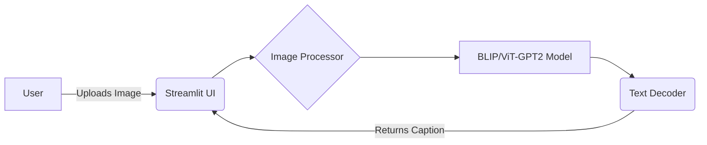

# 🖼️ AI Image Captioning System


An end-to-end AI application that generates intelligent, context-aware captions for images using state-of-the-art Vision-Language models.

## ✨ Features
- **Advanced Vision-Language Modeling:** Utilizes Salesforce's `BLIP-image-captioning-base` for accurate scene understanding.
- **Style Refinement:** Generate captions in different styles (Descriptive, Creative, Technical).
- **Batch Processing:** Upload and process multiple images concurrently.
- **Interactive UI:** Clean, responsive web interface built with Streamlit.

## 🏗️ Architecture


## 🚀 Installation & Usage

1. **Clone the repository:**
   ```bash
   git clone https://github.com/yourusername/ai-image-captioning.git
   cd ai-image-captioning
   ```

2. **Create a virtual environment:**
   ```bash
   python -m venv venv
   source venv/bin/activate  # On Windows use `venv\Scripts\activate`
   ```

3. **Install dependencies:**
   ```bash
   pip install -r requirements.txt
   ```

4. **Run the application:**
   ```bash
   streamlit run app.py
   ```

## 📊 Results / Demo
*(Include screenshots of your running application here)*
- Upload interface with multiple images
- Captions generated with different style modifiers

## 🛠️ Tech Stack
- **Framework:** PyTorch
- **Models:** Hugging Face Transformers
- **Frontend:** Streamlit
- **Image Processing:** Pillow (PIL)
